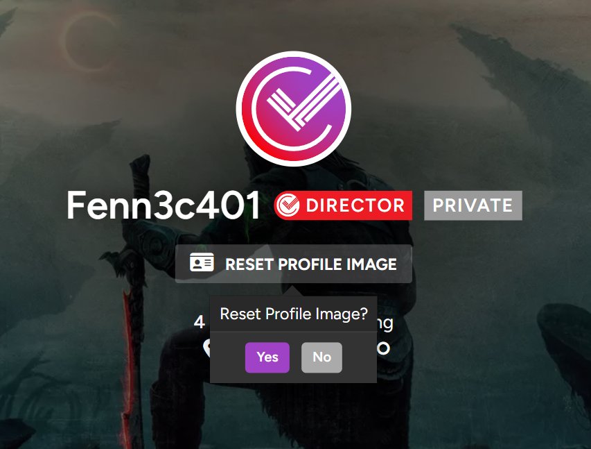

# Trakt.tv | Custom Profile Header Image
A custom profile image for free users. Like the vip feature, except this one only works locally. Uses the native set/reset buttons and changes the dashboard + settings background as well.

## Screenshots

  

