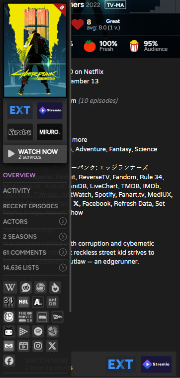

# Trakt.tv | Bug Fixes and Optimizations
A large collection of bug fixes and optimizations for trakt.tv, organized into ~30 independent sections, each with a comment detailing which specific issues are being addressed. Also contains some minor feature patches and general documentation.

## Info
### General
- Please take a look at [the code](../dist/brzmp0a9.user.js) and glimpse over the comments for each section to get an idea as to what exactly you can expect from this script.
- Notably there are also a handful of feature patches included, all of them too minor to warrant a separate userscript:
  - make the "add to list" buttons on grid pages (e.g. /trending) color-coded: 
       = is on watchlist,
       = is on personal list,
       = is on both
  - change the default sorting on /people pages from "released" to "popularity"
  - grey out usernames of deleted profiles in the comments
  - append `(@<userslug>)` to usernames in comments (Trakt allows users to set a "Display Name", separate from the username/slug. This becomes a problem in comment replies
      which always reference the person/comment they are replying to with an `@<userslug>` prefix, which sometimes turns long reply chains into a game of matching pairs..), currently not supported in FF
- The sections below, with the exception of the custom hotkeys, are unrelated to this script, it's just general documentation of native features.

### Hotkeys and Gestures
- ***[CUSTOM]*** `alt + 1/2/3/4/5/6/7`: change header-search-category, 1 for "Shows & Movies", 2 for "Shows", ..., 7 for "Users", also expands header-search if collapsed
- ***[CUSTOM]*** `swipe in from left edge`: display title sidebar on mobile devices
- `meta(win)/ctrl + left click`: open in new tab instead of redirect (applies to header search results + "view watched history" button on title summary pages)
- `/`: expand header-search
- `w`: show filter-by-streaming-services modal
- `t`: show filter-by-terms modal
- `a`: toggle advanced-filters
- `m`: toggle manage-list mode (with item move, delete etc.)
- `r`: toggle reorder-lists mode (change list-rank on /lists page)
- `esc`: collapse header-search, hide popover, hide modal (check-in, watch-now, filter-by-terms)
- `enter`: redirect to selected header-search result, submit (advanced filters selection, date-time-picker input etc.)
- `ctrl + enter`: save note, submit comment
- `arrow-left/right OR p/n OR swipe right/left on fanart`: page navigation (e.g. prev/next episode, prev/next results page)
- `arrow-up/down`: header-search results navigation

### Filter-By-Terms Regex
The filter-by-terms (also called "Filter by Title") function works either server or client-side, depending on whether the exact place you're using it from is paginated or not.
The `/users/<userslug>/lists`, `/seasons` and `/people` pages are all not paginated, so there the filtering is done client-side, with the input being interpreted as a case-insensitive regular expression.
All other places where the filter-by-terms function is available are paginated and therefore use server-side filtering, those usually don't allow for regular expressions, with the exception of
the `/progress` page and list pages. For some reason. The input is matched against:
- list title and description for `/users/<userslug>/lists` pages
- episode title for `/seasons` pages
- title and character name for `/people` pages
- episode and show title for `/progress` pages
- title name for list pages

## Screenshots

  

