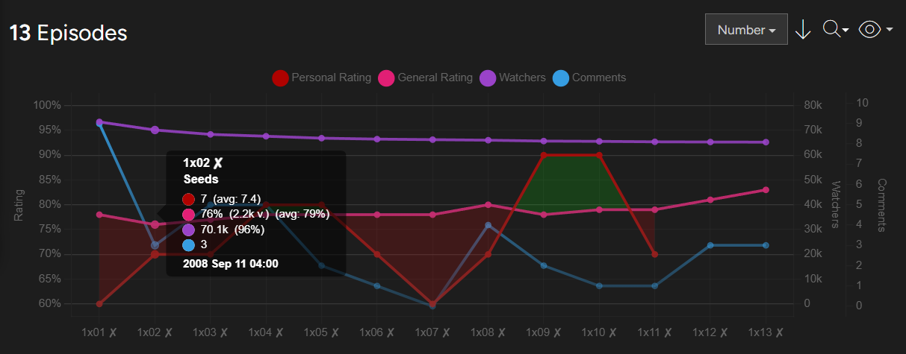

# Trakt.tv | Charts - Seasons
Adds a line chart to /seasons pages which shows the ratings (personal + general) and the number of watchers and comments for each individual episode.

## Info
### General
- Clicking on the individual data points takes you to the summary page of the respective episode (or the comment page for comment data points).
- For charts with more than eight episodes, you can also zoom in by highlighting a section of the x-axis with your mouse. You can zoom out again by clicking anywhere inside the chart.
- This script won't work (well) on mobile devices and the chart is no beauty on light mode either. Basically the whole thing needs an overhaul and is not even close to being finished,
    but the core functionality is there and it might be while until I get back to it, which is why I'm putting it out there as it is right now.

## Screenshots

  

