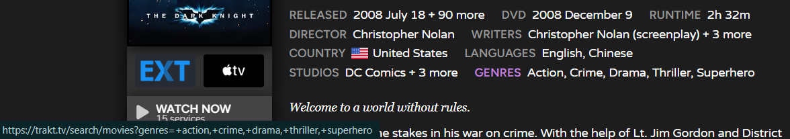

# Trakt.tv | Enhanced Title Metadata
Adds links of filtered search results to the metadata section (studios, networks, genres etc.) on title summary pages. Like the vip feature, only better. Also adds a country flag.

   

## Info
> Inspired by sergeyhist's [Trakt.tv Clickable Info](https://github.com/sergeyhist/trakt-scripts/blob/main/trakt-info.user.js) userscript.

### General
- By clicking on the label for languages, genres, networks and studios, you can make a search for all their respective values combined, ANDed for genres and languages, ORed for networks and studios.
    For example if the genres are "Crime" and "Drama", then a label search will return a selection of other titles that also have the genres "Crime" AND "Drama".
- The search results default to either the "movies" or "shows" search category depending on the type of the current title.
- The title year and certification link to filtered search results as well.
- Mouse middle click opens the filtered search results (including those where the link is dynamically constructed) in a new background tab.
- Flags are not available for all countries.
- A "+ n more" button is added for networks when needed.
- Installing the [Trakt.tv | Partial VIP Unlock](x70tru7b.md) userscript will allow free users to further modify the applied advanced filters, after accessing the filtered search results.
- For the time being this script won't work for vip users.

## Screenshots
