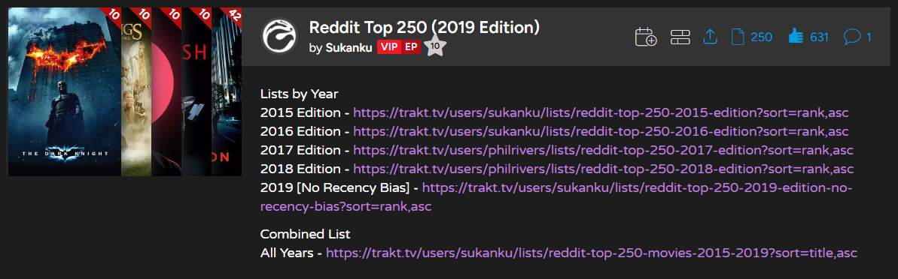

# Trakt.tv | Enhanced List Preview Posters
Makes the posters of list preview stacks/shelves link to the respective title summary pages instead of the list page and adds corner rating indicators for rated titles.

## Info
### General
- The [Trakt.tv | Bug Fixes and Optimizations](brzmp0a9.md) userscript fixes some rating related issues and enables (more) reliable updates of the list-preview-poster rating indicators.

## Screenshots

  

