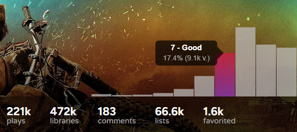

# Trakt.tv | Charts - Ratings Distribution
Adds a ratings distribution (number of users who rated a title 1/10, 2/10 etc.) chart to title summary pages. Also allows for rating the title by clicking on the bars of the chart.

## Screenshots

  

