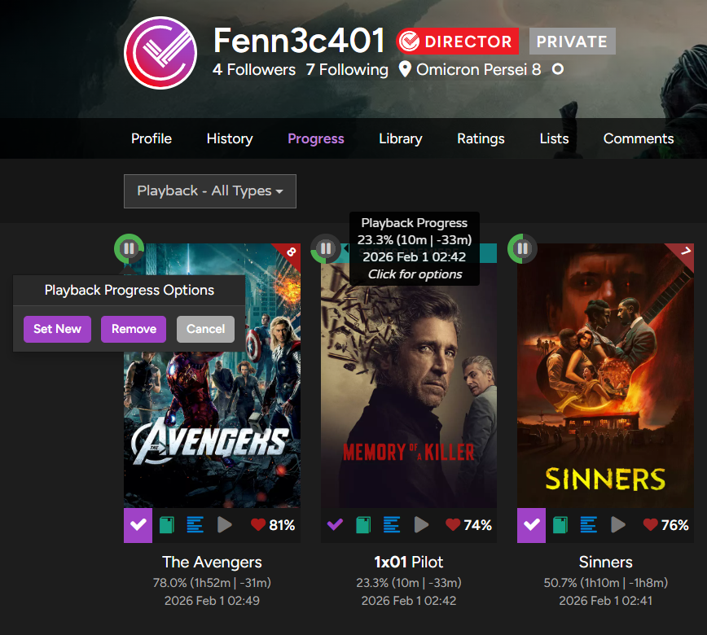
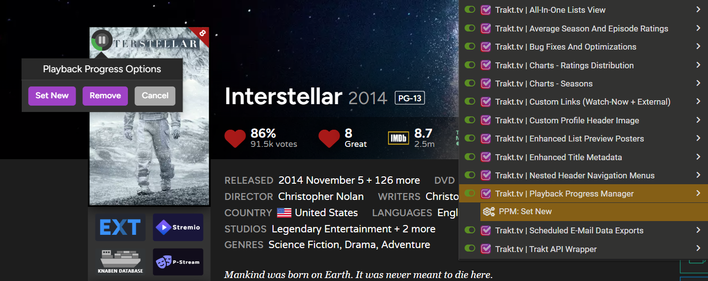
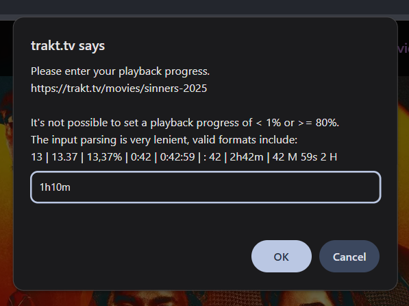

# Trakt.tv | Playback Progress Manager
Adds playback progress badges to in-progress movies/episodes and allows for setting and removing playback progress states. Also adds playback progress overview pages to the "Progress" tab and allows for bulk deletion and renewal. DOES NOT WORK WITHOUT THE "TRAKT API WRAPPER" USERSCRIPT!

## Info
> Inspired by sharkykh's [Trakt.tv Playback Progress Manager](https://sharkykh.github.io/tppm/).

### General
- This script does not work without the [Trakt API Wrapper](f785bub0.md) userscript, so you'll need to install that one as well (or the [Megascript](zzzzzzzz.md)).
- By clicking on a playback progress badge, you can access options to either set a new playback progress state or remove it entirely.
- There are three context menu commands. "Set New" is only available on movie and episode summary pages and allows for setting a new playback progress state for that title.
    "Delete All" and "Renew All" are only available on the [Playback Progress - All Types](https://trakt.tv/users/me/progress/playback) page as those affect all stored playback progress states.
    From my testing the context menu commands are added reliably in Chrome, but not so much in Firefox. Fortunately Tampermonkey allows for triggering context menu commands via its
    extension popup window as well (see the screenshots below), so you can just use that as alternative.
- Playback progress states are automatically removed by Trakt after 6 months. Renewing them postpones the auto-removal by first removing and then setting the
    playback progress states again, while preserving the current order.
- Marking an in-progress movie or episode as watched will also remove the corresponding playback progress state.

### Playback Progress on Trakt
Trakt has supported storing playback progress states for movies and episodes via their api for many years now, however for some reason they never actually bothered to add support
for this to their website, so if you wanted to access those progress states you had to either do it through whichever 3rd party application saved them in the first place,
or use sharkykh's [TPPM](https://sharkykh.github.io/tppm/).

This has changed now, they've finally added native support for this to the new lite version of the website. Specifically on the "continue watching" page you can now see and remove
the playback progress states of movies. From what I can tell there's no episode support, no bulk actions, no option to set a new state and most importantly there are no
playback progress indicators on movie summary pages or any of the other grid views outside of the "continue watching" page. It's a rather lackluster implementation,
though at least it's in line with the rest of their new version.

## Screenshots

  
  
  
  

