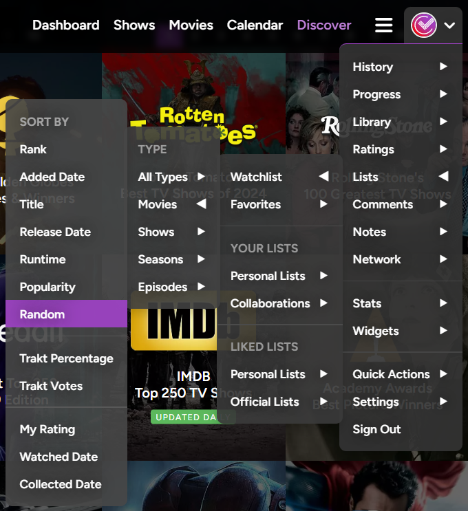

# Trakt.tv | Nested Header Navigation Menus
Adds 150+ dropdown menus with a total of 1000+ entries to the header navigation bar for one-click access to just about any page on the entire website.

## Info
> Based on sergeyhist's [Trakt.tv Hidden Items](https://github.com/sergeyhist/trakt-scripts/blob/main/Legacy/trakt-hidden.user.js) userscript.

## Screenshots

  

