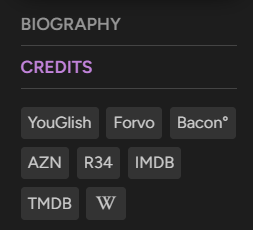

# Trakt.tv | Custom Links (Watch-Now + External)
Adds custom links to all the "Watch-Now" and "External" sections (for titles and people). The ~35 defaults include Letterboxd, Stremio, streaming sites (e.g. P-Stream, Hexa-Watch), torrent aggregators (e.g. EXT, Knaben), various anime sites (both for streaming and tracking) and much more. Easily customizable.

## Info
> Based on Tusky's [Trakt Watchlist Downloader](https://greasyfork.org/scripts/17991) with some sites/features/ideas borrowed from Accus1958's
> [trakt.tv Streaming Services Integration](https://greasyfork.org/scripts/486706), JourneyOver's [External links on Trakt](https://greasyfork.org/en/scripts/547223),
> sergeyhist's [Watch Now Alternative](https://github.com/sergeyhist/trakt-watch-now-alternative) and Tanase Gabriel's [Trakt.tv Universal Search](https://greasyfork.org/en/scripts/508020) userscripts.

### General
- Usually watch-now buttons of grid-items are only displayed if the title has been released and is available for streaming in your selected watch-now country.
    This script changes that by unhiding all watch-now buttons and color coding them as to the title's digital release status. White means the title is available for streaming
    in your selected watch-now country, light-grey means the title is available for streaming in another country and dark-grey means that the title is not available for streaming anywhere.
- `maxSidebarWnLinks` controls how many watch-now links are visible in the watch-now preview of the sidebar.
    The default is 4 and can be modfied in the userscript storage tab *(note: only displayed after first run)*.
- Nearly all links are direct links to e.g. individual episodes, as opposed to search links, anime included. There's also a fix for anime which default to the "wrong" episode group
    (e.g. Solo Leveling is listed with season 2 being part of 1 due to some tmdb shenanigans). YMMV.
- Some links are configured to only be added if certain conditions are met, e.g. anime links are only added for titles where "anime" is included in the genres.
- I only included anime streaming sites with predicatable path schemes, to allow for for direct episode linking. One of these is "Kuroiru", an anime aggregator
    which contains more direct episode links to other popular anime streaming sites like HiAnime or AnimeKai.

### Default Custom Links
#### Watch-Now
- [EXT](https://ext.to) (Torrent Aggregator)
- [Knaben Database](https://knaben.org) (Torrent Aggregator)
- [Stremio](https://www.stremio.com) (Debrid)
- [Kuroiru](https://kuroiru.co) (Anime Aggregator)
- [Miruro](https://www.miruro.to) (Anime Streaming)
- [AniDap](https://anidap.se) (Anime Streaming)
- [GOJO.LIVE](https://animetsu.cc) (Anime Streaming)
- [P-Stream](https://iframe.pstream.mov) (Streaming)
- [Cineby](https://www.cineby.gd) (Streaming)
- [Hexa Watch](https://hexa.watch) (Streaming)
- [FMOVIES+](https://www.fmovies.gd) (Streaming)
- [SceneNZBs](https://scenenzbs.com) (Usenet Indexer)
- [Debrid Media Manager](https://x.debridmediamanager.com) (Debrid)

#### External
- [Reddit](https://www.reddit.com)
- [Letterboxd](https://letterboxd.com)
- [ReverseTV](https://reversetv.enzon19.com)
- [MovieMaps](https://moviemaps.org)
- [Fandom](https://www.fandom.com)
- [AZNude](https://www.aznude.com)
- [CelebGate](https://celeb.gate.cc)
- [Rule 34](https://rule34.xxx)
- [MyAnimeList](https://myanimelist.net)
- [AniList](https://anilist.co)
- [AniDB](https://anidb.net)
- [LiveChart](https://www.livechart.me)
- [TheTVDB](https://thetvdb.com)
- [TVmaze](https://www.tvmaze.com)
- [Spotify](https://open.spotify.com)
- [MediUX](https://mediux.pro)
- [YouGlish](https://youglish.com)
- [Oracle of Bacon](https://oracleofbacon.org)

## Screenshots

  
  
  
  
  

