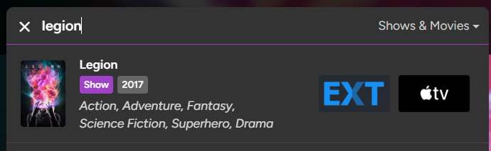

# Trakt.tv | Custom Links (Watch-Now + External)
Adds custom links to all the "Watch-Now" and "External" sections (for titles and people). The ~35 defaults include Letterboxd, Stremio, streaming sites (e.g. P-Stream, Hexa), torrent aggregators (e.g. EXT, Knaben), various anime sites (both for streaming and tracking) and much more. Easily customizable.

## Info
> Based on Tusky's [Trakt Watchlist Downloader](https://greasyfork.org/scripts/17991) with some sites/features/ideas borrowed from Accus1958's
> [trakt.tv Streaming Services Integration](https://greasyfork.org/scripts/486706), JourneyOver's [External links on Trakt](https://greasyfork.org/en/scripts/547223),
> sergeyhist's [Watch Now Alternative](https://github.com/sergeyhist/trakt-watch-now-alternative) and Tanase Gabriel's [Trakt.tv Universal Search](https://greasyfork.org/en/scripts/508020) userscripts.

### General
- `maxSidebarWnLinks` controls how many watch-now links are visible in the watch-now preview of the sidebar. The default is `4` and can be modfied
    in the userscript storage tab *(note: only displayed after first run)*. There you can also modify `torrentResolution` which defaults to `1080p` and
    is used for the query of the torrent and usenet links. Additionally `includeNsfwLinks` controls the visibility of the NSFW links and defaults to `false`.
    For modifications beyond that you'll have to mess with the actual config arrays, which will disable automatic updates of the userscript. *(note: If I ever find the time I'll implement
    a proper gui-based way to toggle, reorder and configure the links. I haven't done so yet, because it adds a decent amount of complexity while providing no real benefit to me personally.)*
- Nearly all links are direct links to e.g. individual episodes, as opposed to search links, anime included.
- There's a "fix" for anime which default to the "wrong" episode group (aka. "alternate seasons"). For example "Solo Leveling" is listed with its second season being part of the first,
    and the episodes for "Cowboy Bebop" are all out of order, which would otherwise mess up direct linking to streaming sites. Trakt uses whichever grouping is used by TMDB and they have some,
    to put it nicely, "questionable" and very much rigid rules regarding e.g. what exactly constitutes a season, the "Attack on Titan" finale being part of the specials is a prime example..
- Some urls are constructed dynamically on click. That means there might be a small delay before the page opens. The resolved url is then also set as href, so on a second click
    the element behaves just like a regular link. A dynamic link is also resolved on right click, so you can e.g. do a double right click with a small delay in between
    to use the "open in incognito window" option like you can with a regular link.
- Some links are configured to only be added if certain conditions are met, e.g. anime links are only added for titles where "anime" is included in the genres.
- I only included anime streaming sites which used some sort of known external id (e.g. mal, anilist) and an episode number for their episode urls, to allow for direct linking.
    One of these is "Kuroiru", an anime aggregator which contains more direct episode links to other popular anime streaming sites like HiAnime or AnimeKai.
- Usually watch-now buttons of grid-items are only displayed if the title has been released and is available for streaming in your selected watch-now country.
    This script changes that by unhiding all watch-now buttons and color coding them as to the title's digital release status. White means the title is available for streaming
    in your selected watch-now country, light-grey means the title is available for streaming in another country and dark-grey means that the title is not available for streaming anywhere.
- A scrollable plot summary is added to the watch-now modal. The watch-now modal and the sidebar are also made scrollable.
- The mobile-layout sidebar from the screenshots is part of the [Trakt.tv | Bug Fixes and Optimizations](brzmp0a9.md) userscript.

### Default Custom Links
#### Watch-Now
- [EXT](https://ext.to) [Torrent Aggregator]
- [Stremio](https://www.stremio.com) [Debrid]
- [Kuroiru](https://kuroiru.co) [Anime Aggregator]
- [Miruro](https://www.miruro.to) [Anime Streaming]
- [AniDap](https://anidap.se) [Anime Streaming]
- [GOJO.LIVE](https://animetsu.cc) [Anime Streaming]
- [Knaben Database](https://knaben.org) [Torrent Aggregator]
- [P-Stream](https://pstream.mov) [Streaming]
- [Cineby](https://www.cineby.gd) [Streaming]
- [Hexa](https://hexa.su) [Streaming]
- [FMOVIES+](https://www.fmovies.gd) [Streaming]
- [SceneNZBs](https://scenenzbs.com) [Usenet Indexer]
- [Debrid Media Manager](https://debridmediamanager.com) [Debrid]

#### External
- [Reddit](https://www.reddit.com) (discussions)
- [Letterboxd](https://letterboxd.com) (popular movie tracking site; lots of users, lists and reviews)
- [ReverseTV](https://reversetv.enzon19.com) ("Where have I seen each cast member before?")
- [MovieMaps](https://moviemaps.org) (interactive map of filming locations)
- [Fandom](https://www.fandom.com) (fan-made encyclopedias)
- [AZNude](https://www.aznude.com) (NSFW; for titles and people)
- [CelebGate](https://celeb.gate.cc) (NSFW; people only)
- [Rule 34](https://rule34.xxx) (NSFW; titles only)
- [MyAnimeList](https://myanimelist.net) (anime tracking site)
- [AniList](https://anilist.co) (anime tracking site)
- [AniDB](https://anidb.net) (anime tracking site)
- [LiveChart](https://www.livechart.me) (anime tracking site)
- [TheTVDB](https://thetvdb.com) (similar to TMDB and IMDb)
- [TVmaze](https://www.tvmaze.com) (tv show tracking site)
- [Rotten Tomatoes](https://www.rottentomatoes.com) (ratings/reviews from professional critics)
- [Metacritic](https://www.metacritic.com) (ratings/reviews from professional critics)
- [Spotify](https://open.spotify.com) (soundtracks)
- [MediUX](https://mediux.pro) (similar to fanart.tv)
- [YouGlish](https://youglish.com) ("How do I pronounce this actors's name?")
- [Oracle of Bacon](https://oracleofbacon.org) ([Six Degrees of Kevin Bacon](https://en.wikipedia.org/wiki/Six_Degrees_of_Kevin_Bacon))

## Screenshots

  
  
  
  

