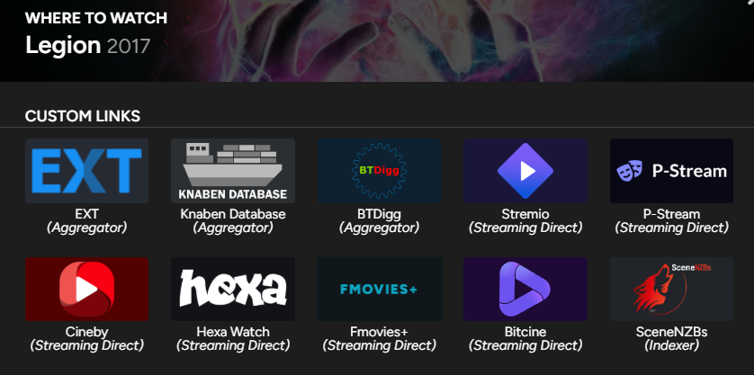

# Trakt.tv | Custom Links (Watch-Now + External)
Adds custom links to all the "Watch-Now" and "External" sections (for titles and people). The defaults include Letterboxd, Stremio, streaming sites (e.g. P-Stream), torrent aggregators (e.g. EXT, Knaben) and more. Easily customizable.

   

## Info
> Inspired by Tusky's [Trakt Watchlist Downloader](https://greasyfork.org/scripts/17991) and Accus1958's [trakt.tv Streaming Services Integration](https://greasyfork.org/scripts/486706) userscripts.

### General
- The installation of the [Trakt.tv | Trakt API Module](f785bub0.md) userscript is optional, as there is a scraping-based fallback, but very much recommended. Scraping is comparatively slow,
    resource-intensive and error prone, with a heavily reduced set of available item-data. You can see what data is available by scraping alone, in the `scrapeFromSummaryPage()` function.
- This script also makes the color of watch-now buttons correspond to the title's digital release status. White means the title is available on a streaming service for your selected watch-now country,
    light-grey means the title is available on a streaming service of another country and dark-grey means that the title is not available on any streaming service.
    Keep in mind that the data-source-counts attribute (which this is based on) can be unreliable, the attribute can be empty despite the title being available for streaming or
    contain sources which don't actually have the title available yet.
- `DEFAULT_WNLINK_ADDITIONS` controls how many custom watch-now links are added to the two-slot watch-now preview on title summary pages and header search results. Can be 0-2.

### Adding/Modifying Custom Links
- Custom links are always inserted above the default links, in the order in which they appear in the respective configuration array.
- Item-data can be of five different types: `movies`, `shows`, `seasons`, `episodes` and `people`. `people` item-data is never provided to watch-now links. `seasons` and `episodes` item-data
    is the same as that for `shows`, except for it having an additional season/episode number property. You can see what data was fetched by checking `window.userscriptItemDataCache` in the console.
- There are eight properties that can be assigned to a custom link, all of which are technically optional, though at least a `name` and either `buildUrl` or `evalOnClick` should be provided:

| *LINK_TYPE* | *PROP_NAME*   | *DESCRIPTION* |
| :---------- | :------------ | :------------ |
| both        | `name`        | The name of the link. For watch-now links this will replace the logo if none is provided. |
| both        | `buildUrl`    | A function which takes item-data and returns an absolute url, which will be opened in a new tab on click. Defaults to current page url + '#' (which does nothing). |
| both        | `evalOnClick` | Will be set as onclick attribute if provided. Useful for e.g. cross-script interactions. Still allows for page navigation if `buildUrl` was set, unless you return `false`. |
| both        | `includeIf`   | A predicate function which takes item-data (and returns a boolean) to decide on whether to include this link for the current item. Defaults to `true`. Useful for e.g. only including a watch-now link if the title is of a specific genre OR not including an external link on `/people` pages. |
| watch_now   | `category`    | A link category to be displayed in a second line below the name. See the `watchNowCategories` object, though any string will work. The category line is omitted if no category is provided. |
| watch_now   | `bgColor`     | The background color of the link button. Defaults to `DEFAULT_WNLINK_BGCOLOR`. |
| watch_now   | `textColor`   | The text color of the link button, which is used for the name that is displayed instead of the logo if none is provided. Defaults to `DEFAULT_WNLINK_TEXTCOLOR`. |
| watch_now   | `logo`        | A logo for the link. Should have a transparent background. Can be a data uri (base64 encoded image, see "Tools" section below) or a regular url. Some external sites may disallow hotlinking of images, in that case use a data uri. Or they may have a restrictive image caching policy (then logo has to constantly be re-fetched, which results in a noticeable loading delay), in that case use `GM_getResourceURL` to have the userscript manager handle caching. |

### Tools
- [https://base64.guru/converter/encode/image](https://base64.guru/converter/encode/image)
- [https://compresspng.com](https://compresspng.com)
- [https://www.svgviewer.dev/](https://www.svgviewer.dev/)

## Screenshots

