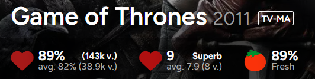

# Trakt.tv | Average Season And Episode Ratings
Shows the average general and personal rating of the seasons of a show and the episodes of a season. You can see the averages for all episodes of a show on its /seasons/all page.

   

## Info
> Inspired by Tusky's [Trakt Average Season Rating](https://greasyfork.org/scripts/30728) userscript.

### General
- The general ratings average is weighted by votes, to account for the inaccurate ratings of unreleased seasons/episodes.
- Specials are always excluded, except on the specials season page.
- Only visible (i.e. not hidden by a filter) items are used for the calculation of the averages and changes to those filters trigger a recalculation.

## Screenshots
